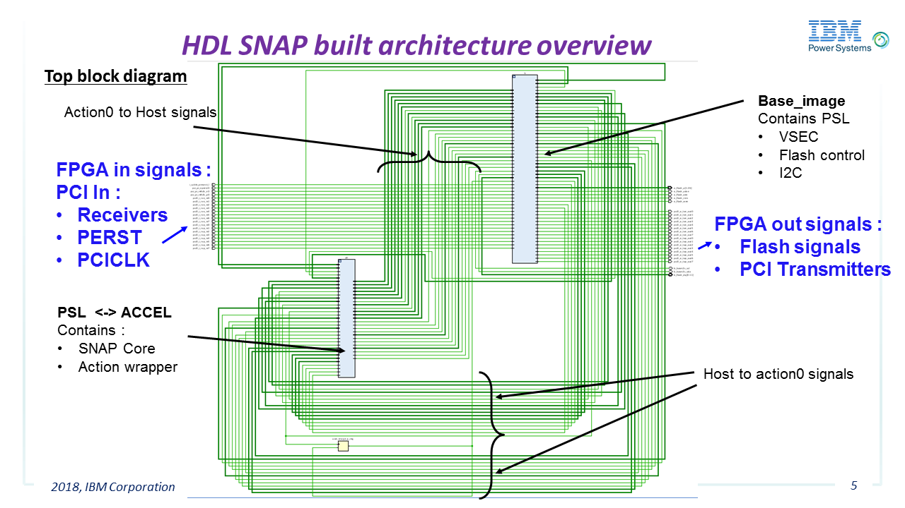
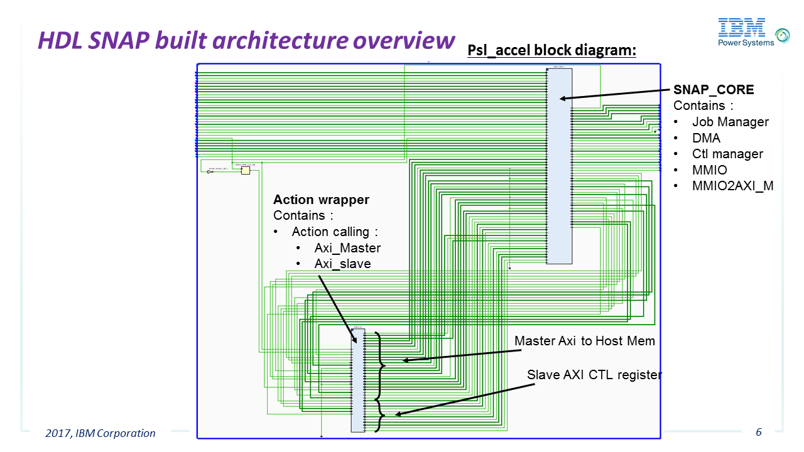

# HDL_example
```
|
│   Makefile                      General Makefile used to automatically prepare the final files
│   README.md                     General documentation file for this example
│
├───doc                           Detailed documentation directory
│       README.md                 This file !   
│
├───hw                            Hardware directory containing all VHDL related items
│       action_axi_master.vhd     AXI Master used to transfer data to/from host through PSL(CAPI)
│       action_axi_nvme.vhd       AXI Master attached to the NVMe Controller
│       action_axi_slave.vhd      AXI slave used to configure control registers
│       action_config.sh          Used to selectively connect hardware drivers
│       action_example.vhd        This file is the result of the make process (once source files have been used)
│       action_example.vhd_source Source file for the generation of action_example.vhd enabling only the configured
|                                 hardware options
│       action_wrapper.vhd_source Wrapper connecting the action with the SNAP framework
│       Makefile                  Makefile used to automatically and selectively prepare the .vhd hardware files
│
├───sw                            Software directory containing the application called from POWER host
│       Makefile
│       snap_example.c            Basic application (runs on POWER) including several examples (counter, memory
|                                 transfers, etc ...)
│       snap_example.h            
│       snap_example_ddr.c        TBD
│       snap_example_nvme.c       TBD
│       snap_example_qnvme.c      TBD
│       snap_example_set.c        TBD
│
└───tests                         Test directory containing all automated tests
        10140000_ddr_test.sh      Basic test shell running snap_example application
        10140000_kill_test.sh     Basic test shell used to test unexpected action interruption
        10140000_nvme_test.sh     Basic test shell running snap_example_nvme application
        10140000_set_test.sh      Basic test shell running snap_example_set application
        10140000_test.sh          Basic test shell running snap_example application
        README.md                 TBD
```
## Hardware Details
The following block diagrams show an overview of main blocks interconnections.

On the following diagram we have the top view showing:
- FPGA pins, connected to PCIe and to configuration flash memory (this directly depends on card schematic and is included in the card PSL_DCP file, see [../../../hardware/README.md](../../../hardware/README.md#snap_env))
- the PSL block (providing PCIe interface and flash controller)
- the action wrapper block


The following diagram details the interconnection between the PSL (which is external to psl_accel), the SNAP core and the action wrapper.

