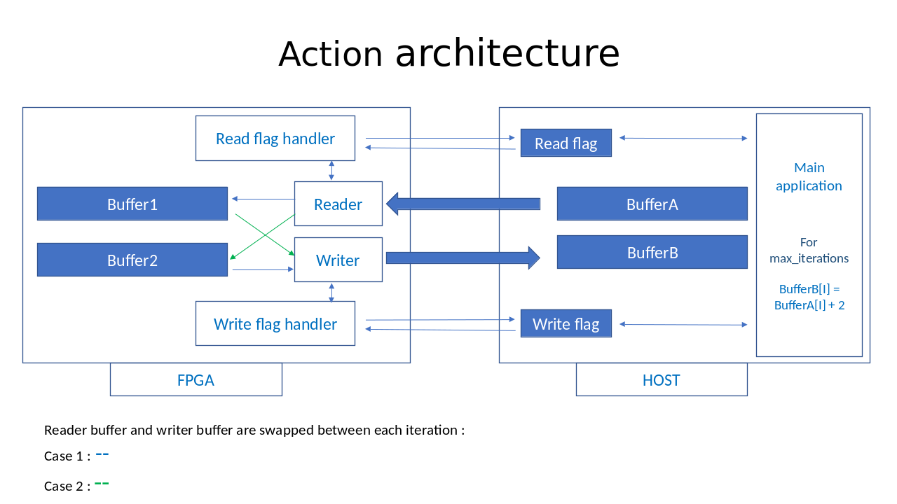

# HLS_PARALLEL_MEMCPY EXAMPLE

* Provides an example to show how read(write) data in parallel from(to) HOST memory using memcpy.
* To maximixe memcpy performance, data is written in 4KB chunks (MAX_BURST size) to maximize bandwidth.
* Data is stored in two internal buffers : one for reading and one for writting. Bewteen each operation,
buffers are swapped in order to observe ping pong exchanges between the HOST and the FPGA for behavior checking
* Bandwidth measurements can be done using this example (but internal memory copy performed on FPGA is included in the measurements)

**Warning:** Due to FPGA internal memory limitations, vector_size cannot be higher than 131072 (which corresponds to 1MB buffers).

## Architecture overview

Buffers are arrays of uin32_t and their sizes are defined at runtime with `vector_size` parameter. Read/write process can be repeted multiple time and this value can be set at runtime using `max_iteration` parameter.



## Bandwidth measurements

|Action version| Vector size (uint32_t)| Num Iterations | Total data transfer (bytes)\* | Average iteration time (us) | Throughput |
| ------------ | --------------------- | -------------- | --------------------------- | --------------------------- | ---------- |
|  0001 (RH7.6)   | 1024     | 10000          |  4096 x 2                   |           4.2               |  1.9 GB/s  |
|  0001 (RH7.6)   | 131072   | 10000          |  524288 x 2                 |           213               |  4.8 GB/s  |

\* size in bytes = vector size * sizeof(uint32_t) and x2 is because we consider bidirectional data transferts.


Files hierarchy: 
```
hls_parallel_memcpy
├── Makefile                          General Makefile used to automatically prepare the final files
├── README.md                         Documentation file for this example
|
├── sw                                Software directory containing application called from POWER host and software action
|   ├── snap_parallel_memcpy.c        APPLICATION which calls the hardware(software) action
|   ├── action_parallel_read_write.c  SW version of the action
|   └── Makefile		                  Makefile to compile the software files
|
├── include                           Common directory to sw and hw
|   └── action_parallel_read_write.h  COMMON HEADER file used by the application and the software/hardware action.
|
└── hw                                Hardware directory containing the hardware action
    ├── action_parallel_read_write.cpp  HARDWARE ACTION which will be executed on FPGA and is called by the application 
    ├── action_parallel_read_write.H    header file containing hardware action parameters
    └── Makefile                      Makefile to compile the hardware action using Vivado HLS synthesizer

```
